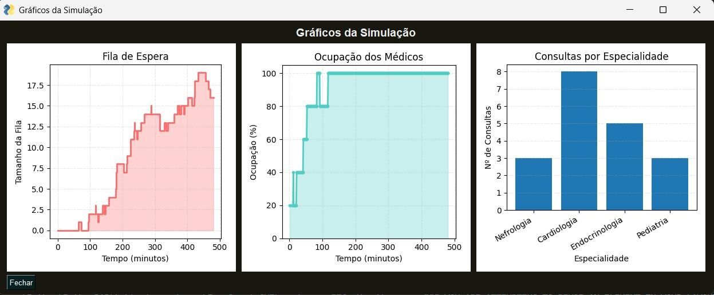
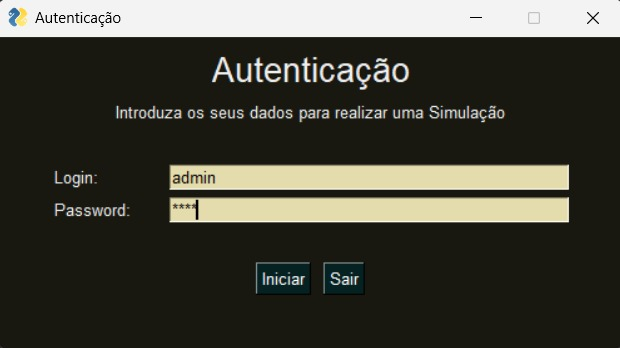
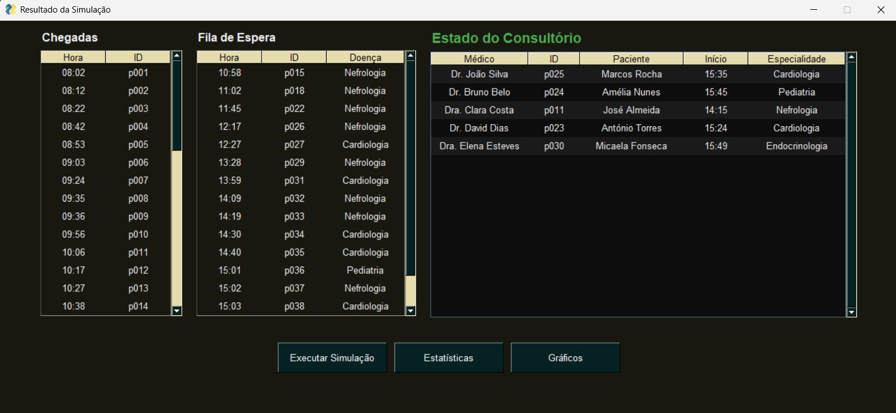
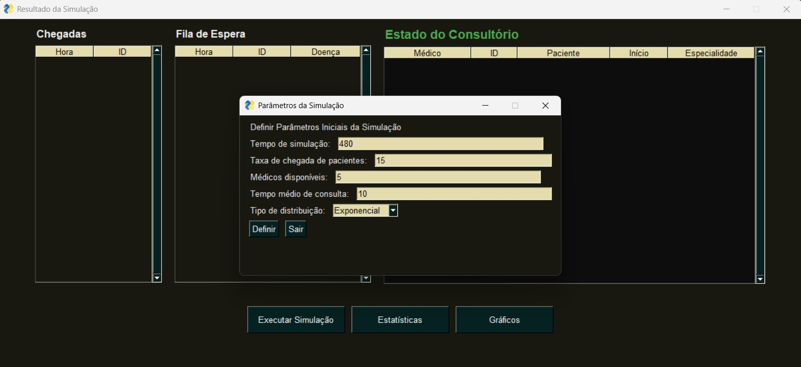
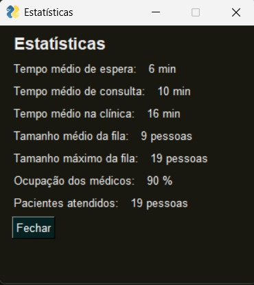

# Projeto ATP: Simulação de uma Clínica Médica
**UC**: Algoritmos e Técnicas de Programação  
**Curso**: Licenciatura em Engenharia Biomédica - Universidade do Minho  
**Alunos**: Sofia Saraiva a107249, Maria Gabriela Silva a107194, Pedro Lousinha a107197


## 1. Introdução e Objetivos
Este projeto consiste no desenvolvimento de um simulador de eventos discretos para simular o funcionamento de uma unidade de saúde. O objetivo principal é analisar o impacto de diferentes variáveis na eficiência do atendimento e na gestão de filas de espera.


## 2. Setup e Instalação
Para executar esta aplicação, é necessário ter o Python instalado e as seguintes bibliotecas:

```bash
pip install FreeSimpleGUI matplotlib numpy
```


### 2.1. Autenticação e Segurança
Para garantir a integridade dos dados da simulação e replicar os protocolos de acesso restrito habituais em sistemas de gestão hospitalar, a aplicação dispõe de um módulo de segurança. O acesso ao painel de controlo requer a validação das seguintes credenciais predefinidas:

* **Utilizador**: `admin`

* **Password**: `1234`


## 3. Estrutura e Organização
Para garantir o correto funcionamento do simulador e o carregamento dos dados, o projeto está organizado com os seguintes ficheiros:

```bash
codigo_projeto.py  # O núcleo da aplicação (Interface e Backend).

patients.json # Base de dados com o histórico e patologias dos doentes.

doctors.json # Configuração do corpo clínico e respetivas especialidades.
```


## 4. Lógica de Simulação: Funcionamento da Clínica
O sistema foi implementado com uma lógica de processamento em tempo real, destacando-se os seguintes componentes técnicos:

* **Motor de Eventos**: Utilização da biblioteca `numpy` para gerar intervalos de chegada baseados num Processo de Poisson (usando a distribuição Exponencial para os intervalos) e durações de consulta baseadas em modelos Exponenciais, Normais ou Uniformes.

* **Algoritmo de Admissão por Especialidade**: Ao contrário de um sistema de fila simples, o código valida a compatibilidade entre a patologia do doente (`illness`) e a especialidade do médico (`specialty`) antes de iniciar a consulta.

```python
def tentar_aceitar_paciente(paciente, arrivalTime, daFilaDeEspera = False ): 
    global lista_medicos, lista_consultas_atuais, TEMPO_ATUAL_SIMULACAO, TEMPO_MEDIO_CONSULTA, lista_filaespera
    if not daFilaDeEspera:
        for m in lista_medicos:
            if m["specialty"] == paciente["illness"]:
                if not any(c for c in lista_consultas_atuais if c["idDoctor"] == m["id"]): 
                    lista_consultas_atuais.append({ 
                        "idPatient": paciente["id"],
                        "patientName": paciente["name"],
                        "idDoctor": m["id"],
                        "doctorName": m["name"],
                        "start": TEMPO_ATUAL_SIMULACAO,
                        "arrival": arrivalTime,
                        "end": TEMPO_ATUAL_SIMULACAO + round(numpy.random.normal(loc=TEMPO_MEDIO_CONSULTA, scale=7)),
                        "illness": paciente["illness"]
                    })
                    print("accepted patient ", paciente["id"], " with doctor ", m["id"])
                    print("current consultations: ", lista_consultas_atuais)
                    return "success"

        print("no available doctor for patient ", paciente["id"], ", adding to waitlist")    
        lista_filaespera.append({ 
            "idPatient": paciente["id"],
            "patientName": paciente["name"],
            "illness": paciente["illness"],
            "arrival": arrivalTime
        })
        print("current waitlist: ", lista_filaespera)
        return "failure"

    if daFilaDeEspera:
        for m in lista_medicos:
            if m["specialty"] == paciente["illness"]:
                    if not any(c for c in lista_consultas_atuais if c["idDoctor"] == m["id"]):
                        lista_consultas_atuais.append({
                            "idPatient": paciente["idPatient"],
                            "patientName":paciente["patientName"],
                            "idDoctor": m["id"],
                            "doctorName": m["name"],
                            "start": TEMPO_ATUAL_SIMULACAO,
                            "arrival": arrivalTime,
                            "end": TEMPO_ATUAL_SIMULACAO + round(numpy.random.normal(loc=TEMPO_MEDIO_CONSULTA, scale=7)),
                            "illness": paciente["illness"]
                        })
                        print("accepted patient ", paciente["idPatient"], " with doctor ", m["id"])
                        print("current consultations: ", lista_consultas_atuais)
                        return "success"
        return "failure"
```

* **Gestão de Chegadas**: As funções `chegada_paciente` e `tentar_aceitar_paciente` verificam se existem médicos disponíveis à chegada de um paciente, e se sim, iniciam consulta, colocando-os na fila de espera em caso contrário. 

```python
def chegada_paciente(): 
    global TEMPO_ATUAL_SIMULACAO, lista_filachegada, lista_pacientes, lista_filaespera
    now = TEMPO_ATUAL_SIMULACAO
    if len(lista_pacientes) == 0:
        return
    lista_filachegada.append({
        "idPatient": lista_pacientes[0]["id"],
        "arrival": now
    })
    
    if len(lista_filaespera) == 0:
        tentar_aceitar_paciente(lista_pacientes[0], now, False)
    else:
        print("patient ", lista_pacientes[0]["id"], " added to waitlist")
        lista_filaespera.append({
            "idPatient": lista_pacientes[0]["id"],
            "patientName": lista_pacientes[0]["name"],
            "illness": lista_pacientes[0]["illness"],
            "arrival": now
        })
        print("current waitlist: ", lista_filaespera)

    lista_pacientes = lista_pacientes[1:]
```

* **Gestão de Saídas e Libertação de Recursos**: O sistema monitoriza o fim de cada consulta, libertando automaticamente o médico e verificando se existe algum paciente na fila de espera com a especialidade correspondente para admissão imediata.


```python
def saida_paciente():
    global TEMPO_ATUAL_SIMULACAO, lista_consultas_atuais, lista_historico_consultas
    to_remove = []
    for c in lista_consultas_atuais:
        if c["end"] <= TEMPO_ATUAL_SIMULACAO:
            for a in lista_filachegada:
                if a["idPatient"] == c["idPatient"]:
                    lista_historico_consultas.append({
                        "idPatient": c["idPatient"],
                        "idDoctor": c["idDoctor"],
                        "arrival": c["arrival"],
                        "start": c["start"],
                        "exit": c["end"],
                        "duration": c["end"] - c["start"],
                        "illness": c["illness"]
                    })
                    to_remove.append(c)
    for c in to_remove:
        lista_consultas_atuais.remove(c)
```
* **Ciclo de Atualização Dinâmica**: Através de um `main_loop` com `timeout`, a interface gráfica é atualizada continuamente, permitindo observar a transição de pacientes entre as tabelas de Chegada, Fila e Consultório.

* **Reset Inteligente**: A utilização da função `restart_simulation()` garante que, ao iniciar uma nova simulação, todas as listas, buffers e métricas estatísticas são repostos. Isto elimina o risco de "contaminação" de dados entre diferentes sessões de teste.


## 5. Monitorização e Resultados Estatísticos
A aplicação utiliza um motor de cálculo que analisa continuamente os eventos estocásticos da clínica para gerar métricas de desempenho em tempo real.

### 5.1. Métricas Calculadas

* **Tempo Médio de Espera**: Diferença entre o momento em que o doente chega e o início efetivo da consulta.

* **Tempo Médio de Consulta**: Duração média dos atendimentos realizados, permitindo validar se os tempos gerados pelas distribuições (Normal, Exponencial ou Uniforme) estão conformes aos parâmetros definidos.

* **Tempo Médio na Clínica**: Duração total da permanência do doente no sistema (Espera + Consulta).

* **Ocupação dos Médicos (%)**: Rácio entre o tempo total em que os médicos estiveram a atender e o tempo total de simulação disponível.

* **Tamanho Médio da Fila**: O número médio de pacientes na fila durante a simulação, calculada com base no tamanho da fila ao longo do tempo considerando a duração de cada estado.

* **Tamanho Máximo da Fila**: O maior número de pacientes na fila durante a simulação, obtida a partir do comprimento da lista que representa a fila no momento da avaliação:

* **Pacientes Atendidos**: O número total de pessoas que foram atendidas (tiveram uma consulta) na clínica.


### 5.2. Lógica de Cálculo
Para garantir o rigor dos dados, o backend do ficheiro (`codigo_projeto.py`) processa estas estatísticas da seguinte forma:

* **Histórico de Consultas**: Sempre que um doente termina o atendimento, os seus dados (chegada, início e fim) são registados numa lista de histórico para calcular as médias finais.

* **Cálculo da Métrica da Fila de Espera**: A função  (`calc_filaespera()`)calc_filaespera() atualiza os principais indicadores da fila de espera ao longo da simulação.
A fila máxima é obtida comparando o tamanho atual da fila com o maior valor registado.
A fila média é calculada como uma média ponderada no tempo, considerando quanto tempo a fila permanece com determinado tamanho.
O tempo médio de espera resulta da média da diferença entre o instante de chegada dos pacientes e o início do atendimento, com base nas consultas concluídas.

```python
def calc_filaespera(): 
    global lista_filaespera, fila_maxima, fila_media, fila_historico, LAST_TICK, tempoespera_media, lista_historico_consultas, TEMPO_ATUAL_SIMULACAO
    if len(lista_filaespera) > fila_maxima:
        fila_maxima = len(lista_filaespera)
    fila_historico.append((len(lista_filaespera), TEMPO_ATUAL_SIMULACAO - LAST_TICK))
    fila_media = sum(size * duration for size, duration in fila_historico) / (TEMPO_ATUAL_SIMULACAO - INICIO_SIMULACAO)
    tempoespera_media = sum((patient["start"] - patient["arrival"]) for patient in lista_historico_consultas) / len(lista_historico_consultas) if lista_historico_consultas else 0
    LAST_TICK = TEMPO_ATUAL_SIMULACAO
```

* **Cálculo da Métrica das Consultas**: A função (`calc_consultas()`) calcula indicadores associados ao atendimento dos pacientes na clínica.
O tempo médio de consulta é obtido a partir da média da duração das consultas concluídas.
O tempo médio na clínica corresponde à média do intervalo entre a chegada do paciente e a sua saída.
O número de pacientes atendidos é determinado pelo total de registos no histórico de consultas finalizadas.

```python
def calc_consultas(): 
    global lista_consultas_atuais, tempoconsulta_media, tempoclinica_media, lista_historico_consultas, pacientes_atendidos, ocupacaomedico_media
    tempoconsulta_media = sum((record["duration"] for record in lista_historico_consultas)) / len(lista_historico_consultas) if lista_historico_consultas else 0
    tempoclinica_media = sum((record["exit"] - record["arrival"] for record in lista_historico_consultas)) / len(lista_historico_consultas) if lista_historico_consultas else 0
    pacientes_atendidos = len(lista_historico_consultas)
    ocupacaomedico_media = calc_ocupacaomedicos()
```

* **Cálculo da Ocupação Média dos Médicos**: A função (`calc_ocupacaomedicos()`) calcula a taxa de ocupação dos médicos ao longo da simulação. Esta é calculada somando a duração de todas as consultas realizadas e dividindo pelo tempo total de disponibilidade de todos os médicos configurados.

```python
def calc_ocupacaomedicos():
    tempo_total_consultas = 0.0

    tempo_total_consultas = sum(r["duration"] for r in lista_historico_consultas)
    for c in lista_consultas_atuais:
        tempo_total_consultas += max(0, min(TEMPO_ATUAL_SIMULACAO, c["end"]) - c["start"])
    tempo_total_disponivel = NUM_MEDICOS * DURACAO_SIMULACAO/ESCALA_TEMPO

    ocupacao = (tempo_total_consultas / tempo_total_disponivel) * 100
    return min(ocupacao, 100.0)
```


## 6. Visualização e Análise Gráfica
Para além da monitorização numérica, a aplicação utiliza a biblioteca `matplotlib` para gerar representações visuais que facilitam a análise de tendências na clínica.

* **Evolução da Fila de Espera**: Utiliza um gráfico de degraus para mostrar as variações em tempo real no número de doentes a aguardar a triagem.

* **Evolução da Ocupação dos Médicos**: Um gráfico de linha que monitoriza a percentagem da equipa clínica que está efetivamente em consulta, permitindo detetar períodos de subutilização ou saturação.

* **Distribuição por Especialidade**: Um histograma que quantifica o volume de consultas realizadas em cada área médica, auxiliando na gestão de recursos humanos da clínica.





## 7. Interface Gráfica com FreeSimpleGUI
A interface gráfica foi desenvolvida utilizando a biblioteca FreeSimpleGUI, proporcionando uma experiência de utilizador intuitiva e interativa. A aplicação está estruturada em diferentes janelas que acompanham o fluxo lógico da simulação:

## 7.1. Janela de Autenticação
Esta interface constitui a primeira barreira de segurança do sistema, replicando os protocolos de acesso restrito comuns em ambientes hospitalares para garantir que apenas pessoal autorizado possa configurar a simulação.

* **Validação de Credenciais**: Implementação de lógica de verificação para utilizador e palavra-passe.

* **Segurança de Entrada**: Utilização do parâmetro `password_char` para ocultar caracteres sensíveis.



## 7.2. Janela de Simulação Principal
Esta é a interface central onde ocorre a monitorização dinâmica da clínica. Está organizada em três componentes principais para permitir uma visão abrangente do sistema:

* **Fluxo de Pacientes**: Listagem em tempo real das tabelas de "Chegadas" e "Fila de Espera".

* **Monitorização do Consultório**: Visualização do estado de cada médico, com indicadores visuais de disponibilidade (cores de estado).

* **Painel de Botões**: Botões que permitem a exibição das janelas de parâmetros, estatísticas e gráficos, respetivamente.



## 7.3. Janela de Parâmetros
Esta interface permite a personalização das condições iniciais do cenário clínico. É nesta fase que o utilizador define a carga de trabalho e a capacidade de resposta da unidade de saúde.

* **Variáveis de Entrada**: Campos dedicados para a taxa de chegada ($\lambda$), tempo de simulação, médicos disponíveis, tempo médio de consulta e tipo de distribuição.

* **Seleção de Modelos de Distribuição**: Utilização de um elemento `sg.Combo` para definir a distribuição de probabilidade (Exponencial, Normal ou Uniforme).

* **Controlo de Fluxo**: Botões de ação para validar os parâmetros e transitar para o motor de simulação.



## 7.4. Janela de Estatísticas
Janela de resumo da simulação, permitindo uma leitura rápida do desempenho da clínica. O sistema organiza os dados recolhidos durante a execução e apresenta-os sob a forma de médias estatísticas.

* **Tempos de Resposta**: Mostra, quanto tempo, em média, os pacientes aguardaram para ser atendidos, quanto tempo demora a consulta e quanto tempo passaram na clínica.

* **Monitorização da Fila**: Indica o estado da fila ao longo do tempo, destacando o maior número de pessoas em espera.

* **Eficiência Médica**: Revela a percentagem de tempo que os médicos passaram efetivamente a atender pacientes, assim como quantos pacientes estes conseguiram atender na totalidade.



## 8. Como utilizar o programa?

* **Autenticação**: Ao abrir o programa, será apresentada uma janela de login. Introduza o utilizador `admin` e a password `1234` para aceder ao painel de controlo principal da clínica.

* **Configuração de Parâmetros**: Ao clicar em "Executar Simulação", definem-se os parâmetros pretendidos.

* **Execução e Monitorização**: Após clicar em "Definir", o sistema realiza o reset das variáveis através da função `restart_simulation()` e inicia o ciclo de eventos. Pode acompanhar em tempo real o movimento dos doentes nas tabelas e as mudanças de estado no consultório.


## 9. Conclusão
Com a realização deste trabalho foi possível desenvolver uma aplicação de simulação em tempo real que representa o funcionamento de uma clínica médica, permitindo observar de forma dinâmica o fluxo de pacientes desde a chegada até ao atendimento. A simulação evidencia como diferentes parâmetros do sistema, como o número de médicos disponíveis na clínica, influenciam diretamente o seu desempenho global.

Os resultados obtidos mostram que a alteração destes parâmetros tem um impacto claro no funcionamento da clínica, refletindo-se em todas as estatísticas calculadas. Desta forma, a aplicação permite analisar diferentes cenários e compreender como pequenas mudanças na configuração do sistema podem afetar significativamente a experiência dos pacientes e a eficiência do atendimento.

Ao longo do desenvolvimento do projeto, foi possível adquirir e consolidar conhecimentos relacionados com a manipulação de estruturas de dados, a implementação de simulações funcionais e a criação de interfaces interativas. Este trabalho contribuiu ainda para uma melhor compreensão de sistemas reais e para o desenvolvimento de competências essenciais na modelação, análise e resolução estruturada de problemas.